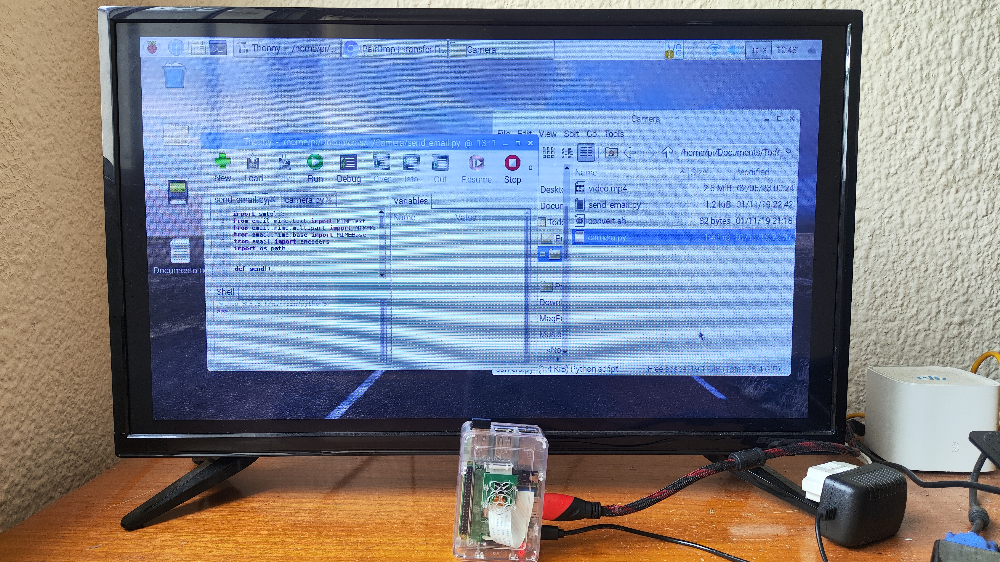
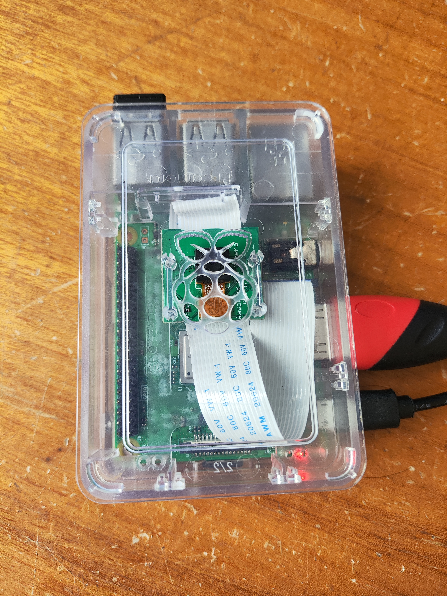
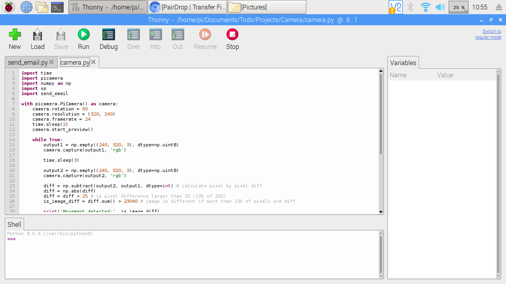
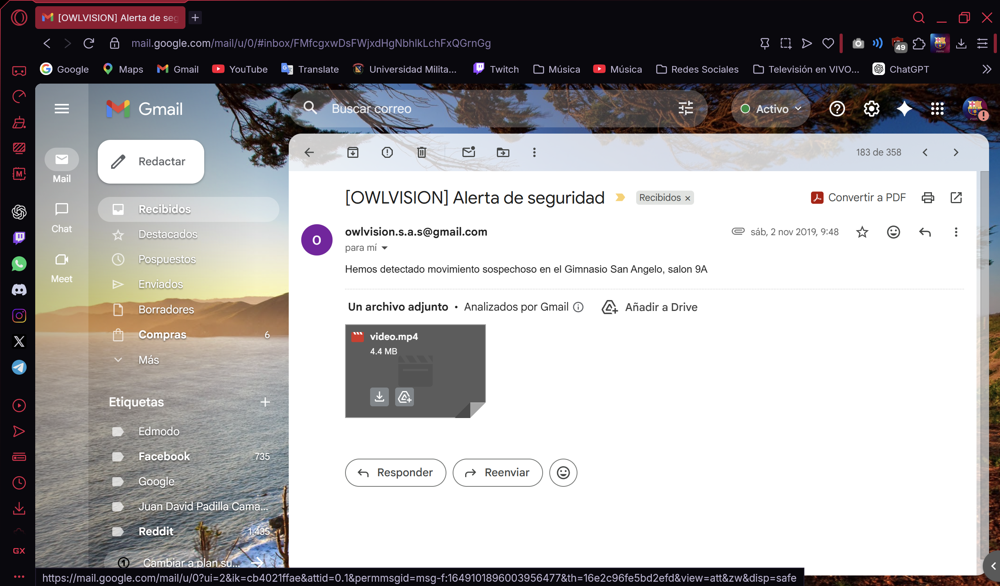

# OWLVision Security Camera

Raspberry Pi security camera system with motion detection and automatic email alerts.

This project was developed as my final high school graduation project (11th grade). The objective was not only to build a working system, but also to simulate the creation of a company and propose a marketable product.

OWLVision was designed as a low-cost smart surveillance solution capable of detecting movement, recording events, and automatically notifying users through email.

---

## Project Overview

The system continuously monitors the environment using a Raspberry Pi camera module.

Workflow:

1. Capture an image frame
2. Capture a second frame after a short delay
3. Compare both images pixel by pixel using NumPy
4. Detect significant movement
5. Record a short video automatically
6. Convert video format using a shell script
7. Send an email notification with the recorded video attached

---

## Technologies Used

- Python
- NumPy
- Raspberry Pi
- PiCamera
- SMTP email services
- Linux
- Shell scripting (.sh)

---

## Project Structure

```text
owlvision-security-camera/
│
├── images/
│   ├── Email.png
│   ├── Pantallazo.png
│   ├── RaspberryPi.jpg
│   └── Tv+RaspberryPi.jpg
│
├── src/
│   ├── camera.py
│   ├── convert.sh
│   └── send_email.py
│
├── README.md
├── LICENSE
```

---

## Main Files Description

### camera.py

Main program responsible for:

- Capturing image frames
- Comparing images
- Detecting movement
- Starting video recording
- Calling additional scripts

### send_email.py

Responsible for:

- Creating email messages
- Attaching video files
- Connecting to SMTP servers
- Sending notifications automatically

### convert.sh

Shell script used for:

- Converting recorded video format
- Preparing files before sending them by email

---

## Hardware Setup

Complete Raspberry Pi environment used during development.



The project was developed and tested using Raspberry Pi hardware with Pi Camera integration.

Hardware detail: Kit Raspberry Pi3 with Raspberry Pi camera rev 1.3



---

## Development Environment

Project development on Raspberry Pi OS using Python and Thonny IDE.



---

## Motion Detection Logic

The system compares two image frames:

```python
diff = np.subtract(output2, output1, dtype=int)
diff = np.abs(diff)
diff = diff > 25
is_image_diff = diff.sum() > 23040
```

Logic explanation:

- Calculate pixel differences
- Convert differences into absolute values
- Apply a threshold value
- Determine whether enough pixels changed
- Trigger recording if movement is detected

---

## Example Email Alert

The system automatically sends an email with the recorded video attached.



---

## Video Demonstration

[](https://youtu.be/6t3PWcIDd-8?si=eqQczVDyiMZb9jkD)

Click the image above to watch the demonstration video.

---

## Notes

This project was originally created in 2019 using the software and Raspberry Pi libraries available at that time.

The repository preserves the original implementation while reorganizing the project structure and documentation for portfolio purposes.
